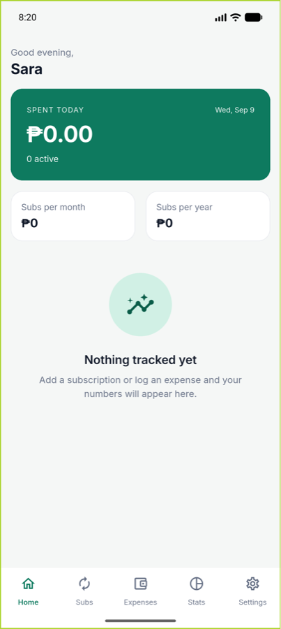
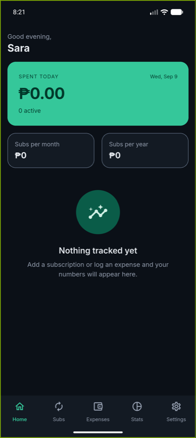
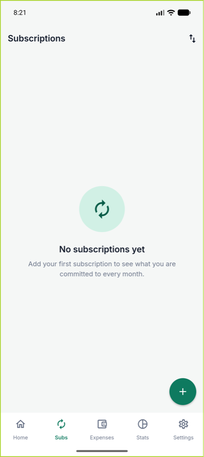
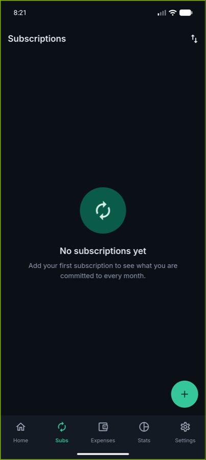
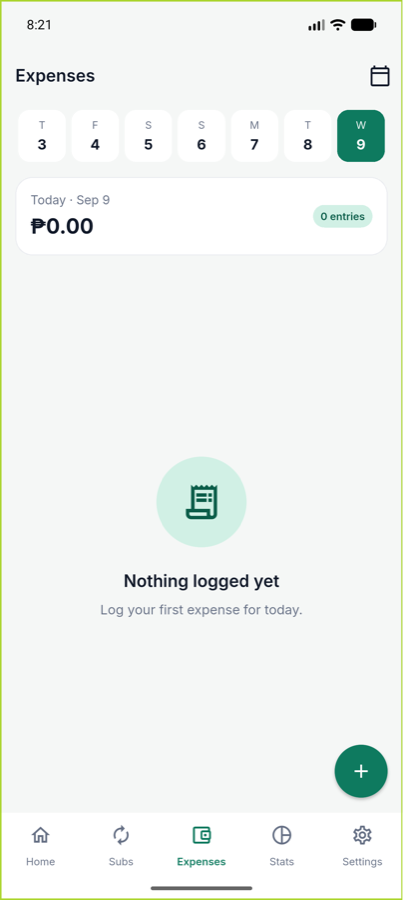
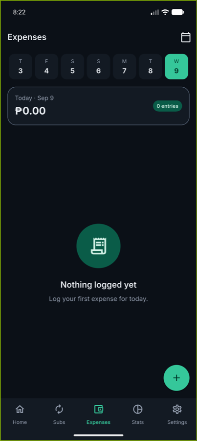
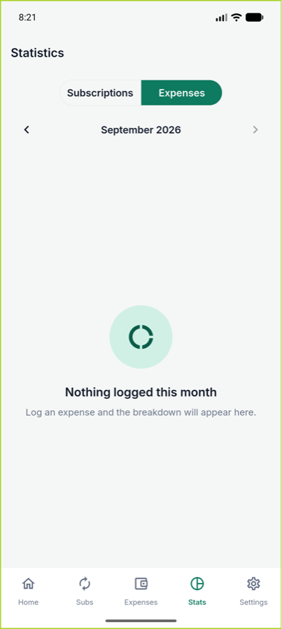
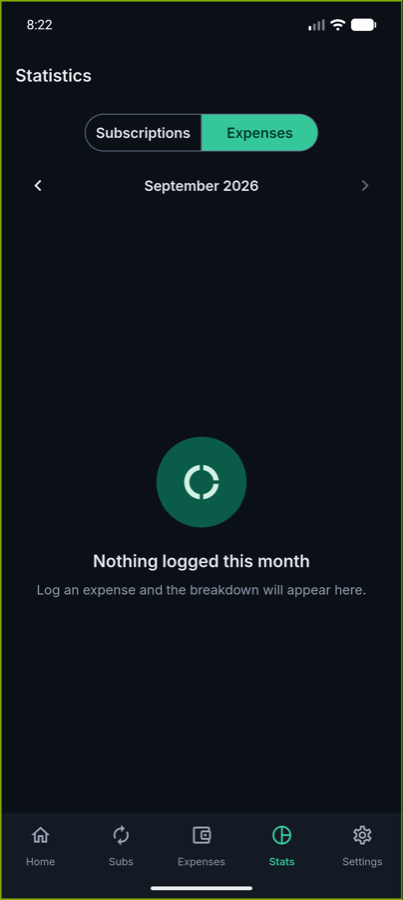

# Pitakap — Your Wallet, Tracked

A personal money tracker that puts your complete spending picture in one app: log daily expenses in seconds, keep every subscription and bill in one place, and get reminded before renewals hit your account.

> *Pitaka* is Tagalog for wallet. Pitakap = Pitaka + App.


---

## Features

- 🔐 **Authentication** — email/password + Google Sign-In, password reset, session restore (Firebase Auth)
- 💳 **Subscription tracking** — full CRUD with four billing cycles, computed next-due dates, category filter and sort
- 🧾 **Daily expense logging** — two-tap entry, per-day view with a date strip, optional payment method
- 📊 **Dashboard & stats** — spent today, monthly/yearly commitments, upcoming payments, category donut chart
- 🔔 **Due-date reminders** — scheduled local notifications, **no server and no Cloud Functions**
- 🌙 **Dark mode** — light/dark/system, persisted
- 📡 **Offline-first** — Firestore offline persistence; the app reads from cache and syncs when back online

## Screenshots

Captured on a Pixel 10 Pro emulator. The same screens in both themes — the dark palette is *derived*, not hand-drawn: the brand green `#0E7A5F` is unreadable as text on dark, so dark mode shifts to a lighter tone `#35C79A` with dark text on it, preserving the hue while fixing contrast.

| | Light | Dark |
|---|---|---|
| **Dashboard** |  |  |
| **Subscriptions** |  |  |
| **Expenses** |  |  |
| **Stats** |  |  |

> These show a **new account**, so every screen is in its empty state. That is deliberate here — empty states are their own design surface in this app, and there are two of them per screen where it matters (the Expenses tab says *"Log your first expense for today"* on today and *"You did not record any spending on this day"* on a past day, because telling you to log today's expense while you browse last Tuesday is a lie). Screenshots with populated data are still to come.

## Tech Stack

| Layer | Choice | Version |
|---|---|---|
| Framework | Flutter · Dart | 3.47 · 3.13 |
| Auth | Firebase Authentication | `firebase_auth ^6.5.7` |
| Database | Cloud Firestore | `cloud_firestore ^6.8.0` |
| State management | Riverpod — `AsyncNotifier` + sealed states | `flutter_riverpod ^3.3.1` |
| Navigation | go_router — `StatefulShellRoute` + reactive auth redirect | `go_router ^17.2.3` |
| Notifications | flutter_local_notifications + timezone | `^22.2.0` · `^0.11.1` |
| Charts | fl_chart | `^1.2.0` |
| Formatting | intl (₱ PHP default) | `^0.20.3` |

## Architecture

Clean Architecture, applied twice — subscriptions and expenses are structurally identical vertical slices.

```
pitakapflutter/lib/
├── core/                    shared infrastructure
│   ├── common/              themed Common* widgets
│   ├── error/               sealed Failure + Auth/Firestore error mappers
│   ├── providers/           DI graph, one file per feature
│   ├── router/              go_router + MainShell + ReminderBootstrap
│   ├── theme/               AppTheme.light() / .dark() from one builder
│   ├── usecase/             UseCase<T>, UseCaseWithParams<T, P>
│   └── utils/               date_utils, currency_format, validators
└── feature/
    ├── auth/                data · domain · presentation
    ├── subscription/        data · domain · presentation
    ├── expense/             data · domain · presentation
    ├── dashboard/           domain · presentation
    ├── stats/               domain · presentation
    ├── profile/             presentation  (settings)
    ├── onboarding/          presentation
    └── splash/              presentation
```

**The dependency rule:** `presentation → domain ← data`. The domain layer imports nothing from the other two, which is what lets it be tested without Firebase at all.

**External services live only in datasources.** Firestore is touched in exactly three files; `flutter_local_notifications` in exactly one. Everything else talks to an abstract repository. Errors surface as sealed `Failure` types, are caught by `AsyncValue.guard` in controllers, and render from sealed state classes — a raw `FirebaseException` never reaches the UI.

### Data model

Flat top-level collections with a `userId` ownership field, queried with `where('userId', isEqualTo: …)`:

```
userDetails/{uid}      firstName · lastName · email · defaultCurrency · createdAt
subscriptions/{id}     userId · name · category · amount · billingCycle ·
                       firstBillDate · reminderDaysBefore · isActive · …
expenses/{id}          userId · description · category · amount ·
                       paymentMethod · date (normalised to midnight local) · …
```

Ownership is enforced server-side in `firestore.rules`. Update rules additionally require `request.resource.data.userId == resource.data.userId`, so a document can never be reassigned to another user.

## Testing

**646 tests, 89.3% line coverage** — no Firebase emulator, no network, no device. The whole suite runs on `flutter test`.

```
cd pitakapflutter
flutter test
flutter test --coverage    # writes coverage/lcov.info
```

| Layer | Line coverage | Lines |
|---|---|---|
| `presentation/` | **96.8%** | 1740 / 1797 |
| `core/` | **94.7%** | 610 / 644 |
| `domain/` | **92.7%** | 291 / 314 |
| `data/` | **52.9%** | 238 / 450 |
| **Overall** | **89.3%** | 2887 / 3232 |

69 of 106 files are at 100%.

**Why `data/` is the outlier, deliberately.** The uncovered lines are almost entirely the Firestore and platform-channel datasources, plus generated `firebase_options.dart`. Exercising those needs a live Firebase SDK, so instead the *contract* around them is tested: every repository is verified against a mocked datasource, and every error path is asserted to surface as a sealed `Failure` with no platform detail leaking into a user-facing message.

That split is the point of the architecture. Domain logic — due-date math across four billing cycles, reminder scheduling and id hashing, category breakdowns, spending summaries — is pure and clock-injected, so it is tested without touching Firebase at all.

## Decisions & Tradeoffs

Each of these was a fork in the road. The reasoning matters more than the choice.

### Local notifications instead of Cloud Functions

Server-pushed reminders would need Cloud Functions, a paid plan, and an always-on process. Instead, reminders are scheduled **on the device** whenever a subscription is written, and `rescheduleAllReminders` re-syncs them from Firestore on every sign-in. The app stays 100% serverless on Firebase's free tier.

**The tradeoff, stated honestly:** a reminder due between a device reboot and the next app launch will not fire, because `RECEIVE_BOOT_COMPLETED` was deliberately not declared. Accepted — re-scheduling on launch covers the realistic case, and a boot receiver is redundant plumbing for a personal tracker.

Notifications also use `AndroidScheduleMode.inexactAllowWhileIdle` on purpose: an exact alarm would demand the `SCHEDULE_EXACT_ALARM` permission and a second system prompt. A bill reminder being a few minutes off is fine; a second permission dialog is not.

### Next due dates are computed, never stored

Storing `nextDueDate` means a server job to roll it forward, and stale data the moment one fails. Instead `firstBillDate` + `billingCycle` are stored and the next date is derived at read time.

Two rules make that safe, and both are unit-tested:
- **Month-end clamping always measures from the original anchor.** Jan 31 → Feb 28 → **Mar 31**, never Feb 28 → Mar 28. A subscription cannot drift earlier every February.
- **Calendar arithmetic, never `Duration`.** `Duration(days: 7)` across a DST boundary shifts the hour and truncates day counts.

### The clock is always a parameter

Every time-dependent function takes an explicit reference date (`nextDueDateAsOf(from)`, `applyListFilter(…, now:)`), with a bare getter wrapping `DateTime.now()` for callers. Tests never touch the wall clock, and a test can move `now` forward and assert an upcoming-payments list reorders.

This was learned the hard way: a widget test that asserted on date-dependent *order* failed roughly ten days a month, because for monthly subscriptions the next-due order is always a cyclic rotation of the day-ascending sequence. The fix asserts the *invariant* (the result is ascending by next due date) rather than one permutation — and a companion test proves the naive fixture choice would collide, so the reasoning cannot be lost.

### `toUpdateMap()` structurally omits `userId`

The security rule requires `userId` to be unchanged on update. Rather than rewriting the same value and trusting it to match, the field is **never in the update payload** — so a bug in an edit form *cannot* reassign a record to another user. `createdAt` is omitted for the same reason. Both absences are asserted by tests.

### Re-entry is guarded at the controller, not the button

Disabling a button does not disable the other ways to fire the same action — `onFieldSubmitted` on a keyboard's done key bypassed every disabled button and fired concurrent sign-in requests. Every controller now exposes `isBusy` and returns early on re-entry; disabled buttons are cosmetic reinforcement, not the defence.

The test for this needs a `Completer` gate to hold the first call open while the second starts — without it, the first resolves first and the test passes *even with the bug present*.

### Two equality filters instead of a range query

A day's expenses are fetched with `userId ==` **and** `date ==` (normalised to midnight local), which needs no composite index. Only the Stats month view uses a real range query, and its index is **declared in `firestore.indexes.json`** and deployed with the rules — versioned with the code rather than clicked from a console error link.

The day-normalisation is load-bearing beyond the query: `WatchExpensesForDayParams` normalises in its **constructor** and has value equality, because it is the key of a `StreamProvider.family` and Riverpod families key by `==`. A day carrying a time component would open a fresh Firestore listener on every rebuild.

### Undo restores by ID rather than re-creating

Swipe-to-delete originally re-created the document on undo, which minted a **new ID**. Once reminders became keyed by subscription ID, that would orphan the scheduled notification. Both flows now use `.doc(id).set(toRestoreMap())`, preserving the original ID and `createdAt`.

No security-rule change was needed, and that was **verified rather than assumed**: on a deleted document `set()` is a `create` in rules terms, and `toRestoreMap()` includes `userId`, so the existing rule is satisfied either way.

### Reminder failures never fail the write

Every notification call in the repository goes through a wrapper that swallows notification errors. A denied notification permission must not break *saving a subscription*. A Firestore **read** failure still propagates — the optional part is the reminder, not the data.

## Getting Started

The Flutter app lives in [`pitakapflutter/`](pitakapflutter).

```
cd pitakapflutter
flutter pub get
flutter run
```

Requires your own Firebase project:

```
dart pub global activate flutterfire_cli
flutterfire configure --project=<your-project-id> --platforms=android,ios
firebase deploy --only firestore:rules,firestore:indexes
```

Enable **Email/Password** (and optionally **Google**) under Authentication → Sign-in method. Google Sign-In on Android additionally needs your debug/release SHA-1 registered on the Firebase Android app.

## Building a release APK

Release builds fall back to debug signing until a keystore is configured, so `flutter run --release` works out of the box. For a real signed build:

```
keytool -genkey -v -keystore ~/pitakap-upload-keystore.jks \
  -keyalg RSA -keysize 2048 -validity 10000 -alias upload
```

Copy [`android/key.properties.example`](pitakapflutter/android/key.properties.example) to `android/key.properties` and fill it in — `key.properties`, `*.jks` and `*.keystore` are already gitignored — then:

```
cd pitakapflutter
flutter build apk --release          # or --split-per-abi for smaller artifacts
```

**Back the keystore up.** Losing it means never being able to update the same Play Store listing again.

## Project layout

```
PitakapFlutter/
├── README.md              this file
└── pitakapflutter/        the Flutter app
    ├── lib/               113 Dart files
    ├── test/              47 test files
    ├── firestore.rules
    └── firestore.indexes.json
```
